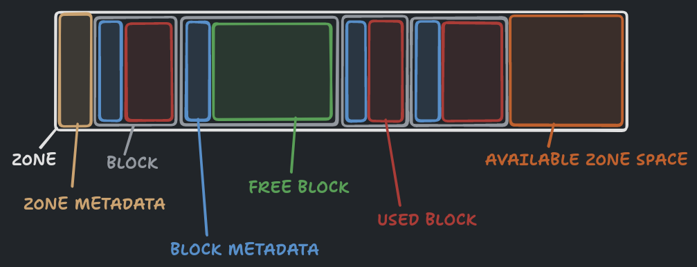

# Malloc

This project is about implementing a dynamic memory allocation mechanism.

## Description

Malloc is a C project whose aim is to create a shared library of dynamic memory allocation management to replace the 3 existing libc functions: `malloc`, `free` and `realloc`.



In order to optimize performance and avoid having to call `mmap` each time a new allocation request is made, memory zones (tiny and small) are preallocated to contain a minimum of 100 memory blocks of max size x. So when an user requests an allocation whose max size corresponds to one of these 2 zones, a new memory block within these zones will be created (if possible) rather than a new zone. If the requested size is greater than the max value of a small block, then a big zone is simply created, containing only one memory block.

A global doubly linked list of metadata is used to contain all the information on zones and blocks created during the program's lifetime. These metadata are added at the head of each zone and block in order to retain information specific to them (size, type, etc.).

A memory zone is freed with `munmap` once all the blocks inside have been freed. 1 tiny and small zone are however always preallocated in order to limit calls to `mmap` if only 1 zone ever exists. To avoid fragmentation of memory, continuous blocks are merged together if both have been freed (and if their combined size doesn't exceed the max size).

The pointer address returned by malloc is aligned to 16 bytes.

Two functions exist to display the current state of the allocated zones and blocks : `show_alloc_mem` and `show_alloc_mem_ex`. The last one prints a hex dump of the allocated memory.

All the functions from this shared library are thread-safe thanks to the usage of a global mutex.

The default behavior of the library can be modified with 2 environment variables : `FT_MALLOC_MAX_ZONES` and `FT_MALLOC_MAX_SIZE`, which either sets a limit to the maximum number of zones which can be allocated, or limits the maximum size of an allocation.

Overall, the project provides a deeper understanding of memory management within an operating system and a computer.

## Usage

```bash
# build the shared library
make

# build and run the tests
cd tests && make && ./tests
```
